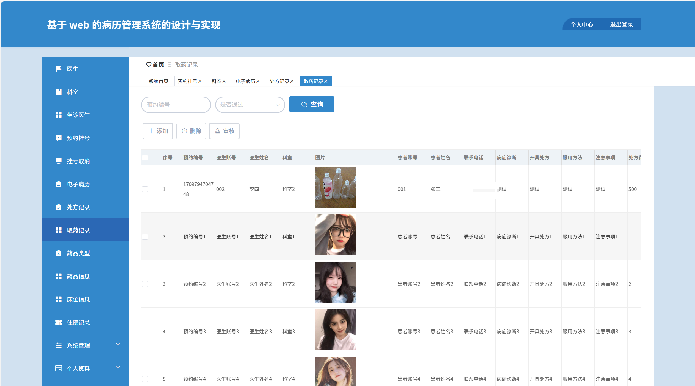

# springbootA417
springbootA417病历管理系统+LW
 
## 查看主页获取源码

### 一、关键词

电子病历系统，健康档案管理系统，医院病历管理系统
 

### 二、作品包含

源码+数据库+设计文档万字+全套环境和工具资源+部署教程

 

### 三、项目技术

前端技术：Html、Css、Js、Vue2.0、Element-ui 
后端技术：Java、SpringBoot2.0、MyBatis

  

 

### 四、运行环境（以下版本亲测，其他版本未知，请自测）

开发工具：IDEA/eclipse  + VSCODE

数据库：MySQL5.7（最低要5.7版本）

数据库管理工具：Navicat10以上版本

环境配置软件： JDK1.8 + Maven3.6.3

前端Nodejs：14

浏览器：谷歌浏览器

 

### 五、项目介绍

项目编号：springbootA417

提高医院内部病例管理的效率和准确性，同时提供更便捷的医疗服务。系统采用了Spring Boot作为开发框架，具有快速搭建、简化配置等特点，为系统的开发与部署提供了便利。在系统设计方面，采用了模块化的设计思想，将病例管理、患者信息等功能划分为不同的模块，提高了系统的可维护性和扩展性。在实现过程中，将系统的业务逻辑、数据处理和用户界面分离开来，使得系统结构清晰，易于理解与维护。同时加强系统的安全性，确保用户信息和病例数据的机密性和完整性。

### 六、运行截图

